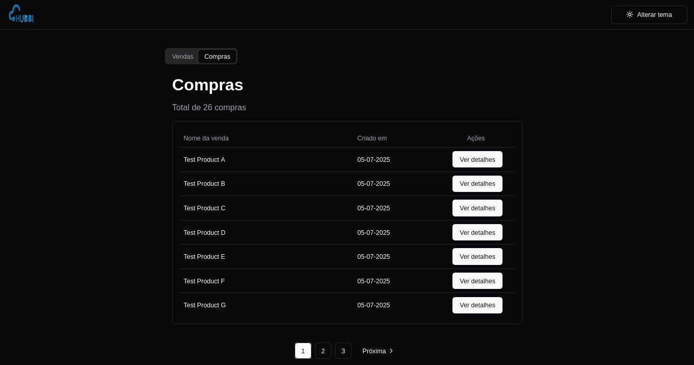
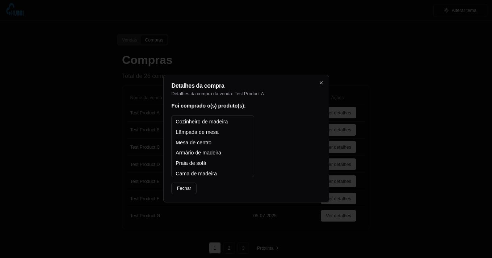
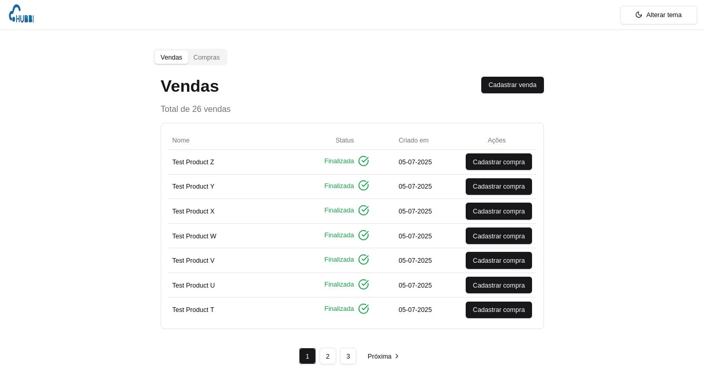
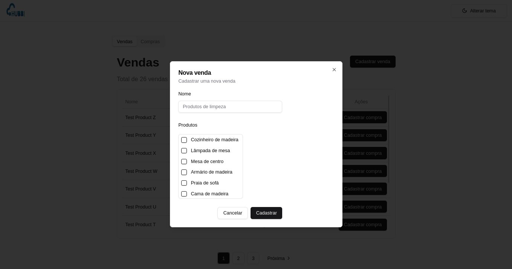
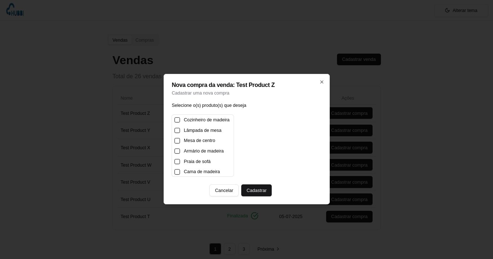
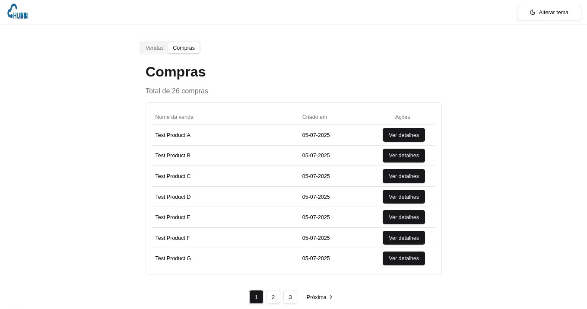

<h1 align="center">Desafio full stack da Hubbi</h1>

  <a href="#descrição">Descrição</a>&nbsp;&nbsp;&nbsp;|&nbsp;&nbsp;&nbsp;
  <a href="#tecnologias">Tecnologias</a>&nbsp;&nbsp;&nbsp;|&nbsp;&nbsp;&nbsp;
  <a href="#documentação-do-servidor">Documentação do servidor</a>&nbsp;&nbsp;&nbsp;|&nbsp;&nbsp;&nbsp;
  <a href="#documentação-do-servidor-web">Documentação do servidor web</a>&nbsp;&nbsp;&nbsp;|&nbsp;&nbsp;&nbsp;
   
  <a href="#licença">Licença</a>

    <h2>Modo escuro</h2>
    
    
    
    
    
    <h2>Modo claro</h2>
    
    
    
    
    

## Descrição

##### Teste de desenvolvedor full-stack Node.JS & React.JS

## Tecnologias

- [Node.js LTS](https://nodejs.org/pt-br/)
- [Next.js](https://nextjs.org/)
- [React.js](https://react.dev/)
- [Shadcn/ui](https://ui.shadcn.com/)
- [Tailwindcss](https://tailwindcss.com/)
- [React Hook Form](https://react-hook-form.com/)
- [Zod](https://zod.dev/)
- [Playwright](https://playwright.dev/)
- [Typescript](https://www.typescriptlang.org/)
- [ESLint](https://eslint.org/)
- [Prettier](https://prettier.io/)
- [Express](https://expressjs.com/)
- [Prisma](https://www.prisma.io/)
- [Docker](https://www.docker.com/)
- [Docker Compose](https://docs.docker.com/compose/install/)

## Documentação do servidor

Clique [aqui](./server/README.md) para visualizar a documentação do servidor

## Documentação do servidor web

Clique [aqui](./web/README.md) para visualizar a documentação do servidor web

## Licença

Esse projeto está sob a licença MIT. Veja o arquivo [LICENSE](./LICENSE.md) para mais detalhes.
