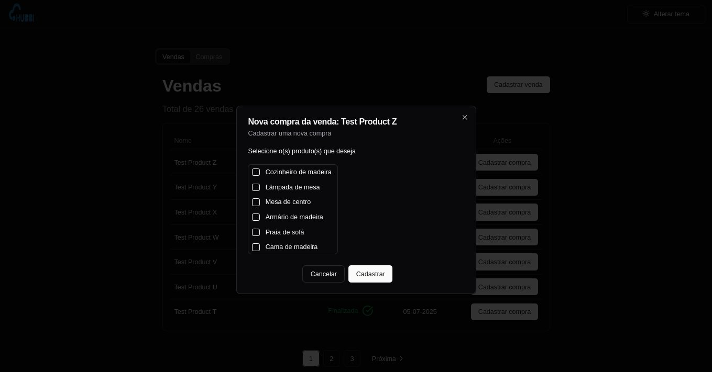

<h1 align="center">Hubbi UI</h1>

<p align="center">
  <a href="#descrição">Descrição</a>&nbsp;&nbsp;&nbsp;|&nbsp;&nbsp;&nbsp;
  <a href="#tecnologias">Tecnologias</a>&nbsp;&nbsp;&nbsp;|&nbsp;&nbsp;&nbsp;
  <a href="#requisitos">Requisitos</a>&nbsp;&nbsp;&nbsp;|&nbsp;&nbsp;&nbsp;
  <a href="#inicializando-a-aplicação">Inicializando a aplicação</a>&nbsp;&nbsp;&nbsp;|&nbsp;&nbsp;&nbsp;
  <br/>
  <a href="#scripts-da-aplicação">Scripts da aplicação</a>&nbsp;&nbsp;&nbsp;|&nbsp;&nbsp;&nbsp;
  <a href="#para-executar-os-testes-na-linha-de-comando">Teste</a>&nbsp;&nbsp;&nbsp;|&nbsp;&nbsp;&nbsp;
  <a href="#licença">Licença</a>
</p>

## Descrição

##### Aplicação web para o teste de desenvolvedor full-stack Node.JS & React.JS

<div align="center">
    <h2>Modo escuro</h2>
    
    
    
    
    
    <h2>Modo claro</h2>
    
    
    
    
    
</div>

## Tecnologias

- [Node.js LTS](https://nodejs.org/pt-br/)
- [Next.js](https://nextjs.org/)
- [React.js](https://react.dev/)
- [Shadcn/ui](https://ui.shadcn.com/)
- [Tailwindcss](https://tailwindcss.com/)
- [React Hook Form](https://react-hook-form.com/)
- [Zod](https://zod.dev/)
- [Playwright](https://playwright.dev/)
- [Typescript](https://www.typescriptlang.org/)
- [ESLint](https://eslint.org/)
- [Prettier](https://prettier.io/)

## Requisitos

- [Node.js LTS](https://nodejs.org/pt-br/)

## Inicializando a aplicação

Primeiro, instale as dependências executando o comando:

```bash
npm install
```

segundo, execute o servidor de desenvolvimento:

```bash
npm run dev
```

Após o servidor executar, abra [http://localhost:3000](http://localhost:3000) com seu navegador para ver o resultado.

## Scripts da aplicação

#### Para executar o servidor em modo de desenvolvimento

```bash
npm run dev
```

#### Para transpilar o código em TypeScript para JavaScript

```bash
npm run build
```

#### Para executar o código JavaScript

```bash
npm run start
```

#### Para fazer o lint no código

```bash
npm run lint
```

#### Para executar os testes na linha de comando

```bash
npm run test:e2e
```

#### Para executar a interface gráfica dos testes

```bash
npm run test:e2e-ui
```

## Teste

#### Para executar os testes na linha de comando

Execute o comando

```bash
npm run test:e2e
```

#### Para executar a interface gráfica dos testes

Execute o comando

```bash
npm run test:e2e-ui
```

## Licença

Esse projeto está sob a licença MIT. Veja o arquivo [LICENSE](../LICENSE.md) para mais detalhes.
